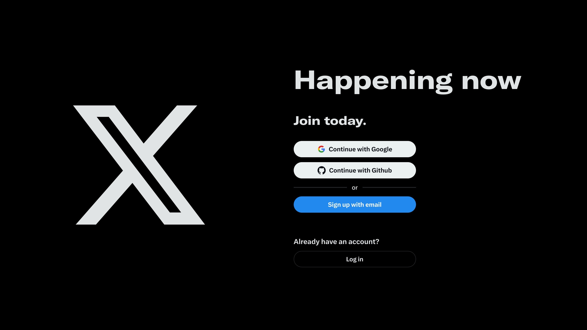

# TWITTER CLONE

[](https://twitter-alihamas.vercel.app)

A full-stack Twitter clone built with: [Next.js](https://nextjs.org/), [Prisma](https://www.prisma.io/), [Supabase](https://supabase.com/), [TanStack Query](https://tanstack.com/query/latest), [shadcn/ui](https://ui.shadcn.com/), and [TailwindCSS](https://tailwindcss.com/).


## Features

- Social authentication via google and github
- Create, delete, like, repost and bookmark posts
- Infinite scrolling and dynamic routing
- Profile editing and image uploads

## Getting Started

1. **Clone the repository:**

   ```sh
   git clone https://github.com/alihamasdev/twitter-clone.git
   ```

2. **Install dependencies:**

   ```sh
   bun install
   ```

3. **Configure environment variables:**
   - Copy `.env.example` to `.env` and fill in your Supabase and database credentials.

4. **Run database migrations:**

   ```sh
   bunx prisma migrate dev
   ```

5. **Start the development server:**
   ```sh
   bun dev
   ```

## Project Structure

- `src/` — App source code
- `prisma/` — Prisma schema
- `public/` — Static assets
- `.env` — Environment variables

## Contributing

Feel free to fork and submit pull requests. See [CONTRIBUTING.md](CONTRIBUTING.md) for guidelines.

---

Explore the codebase and contribute at [GitHub Repository](https://github.com/alihamasdev/twitter-clone)
